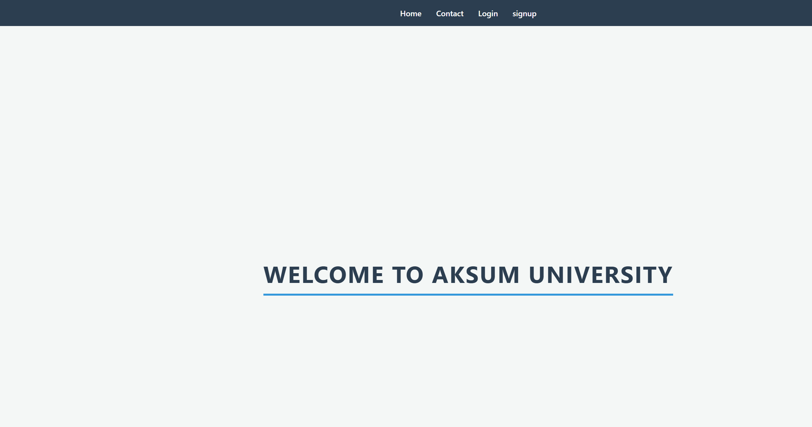
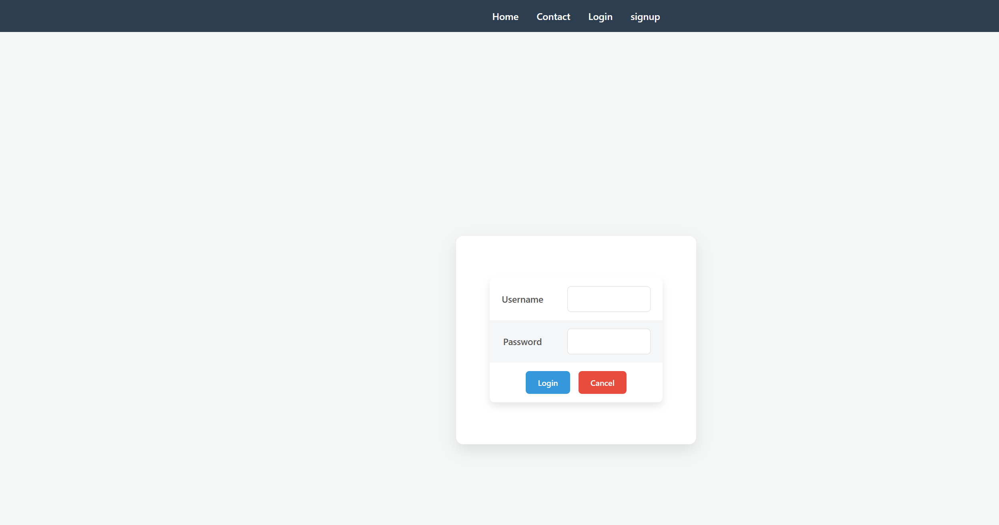
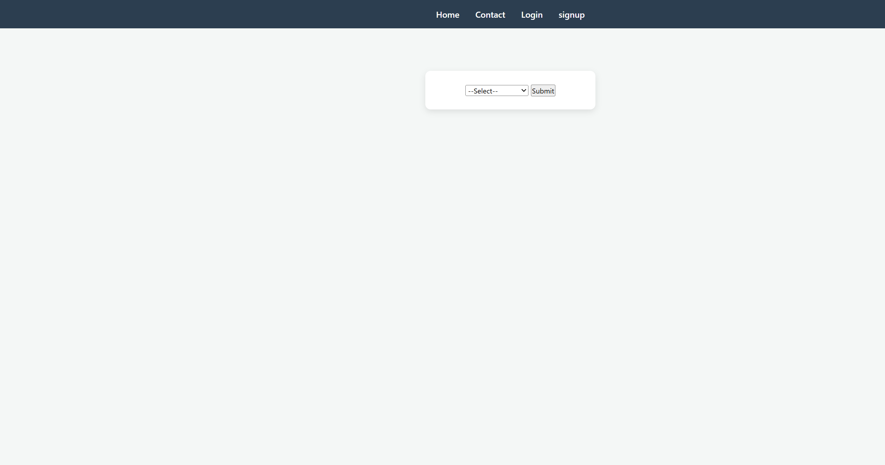
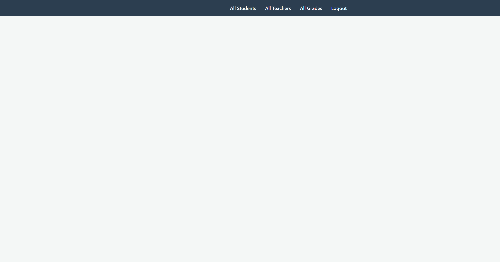
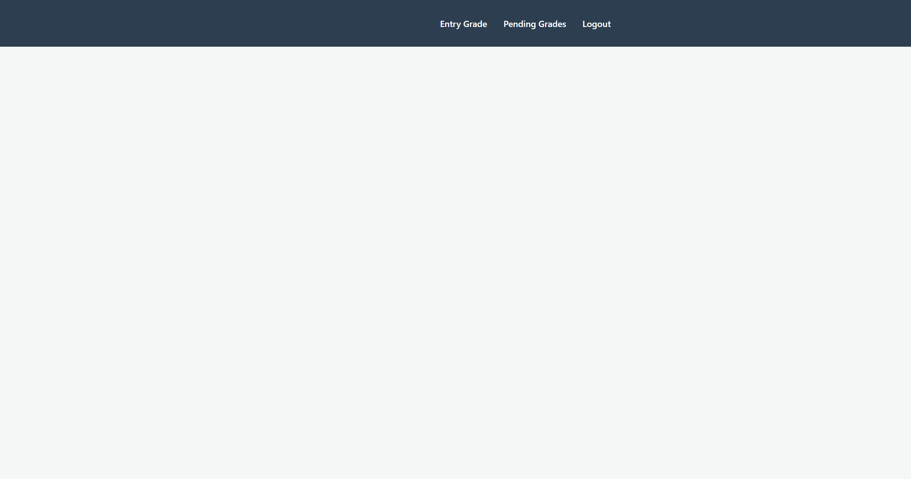
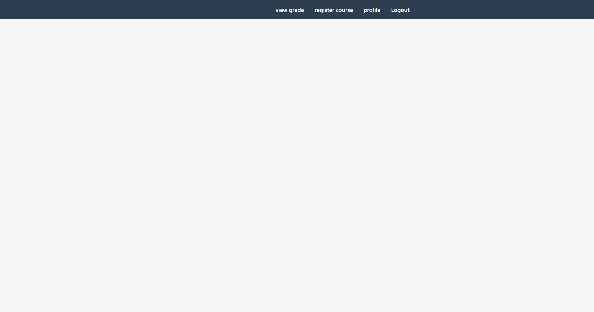
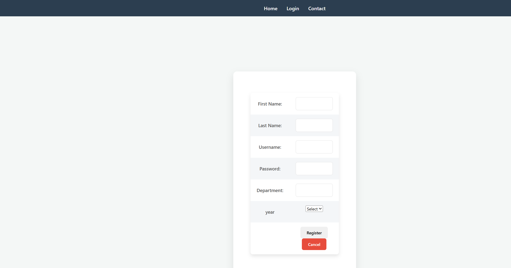
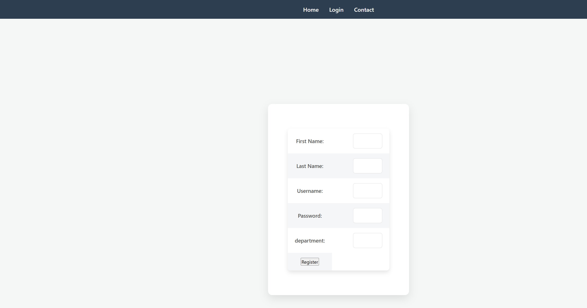
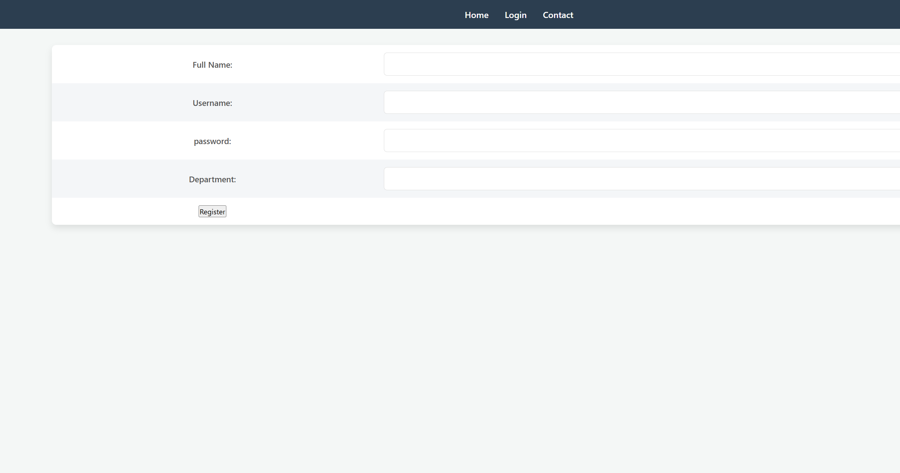
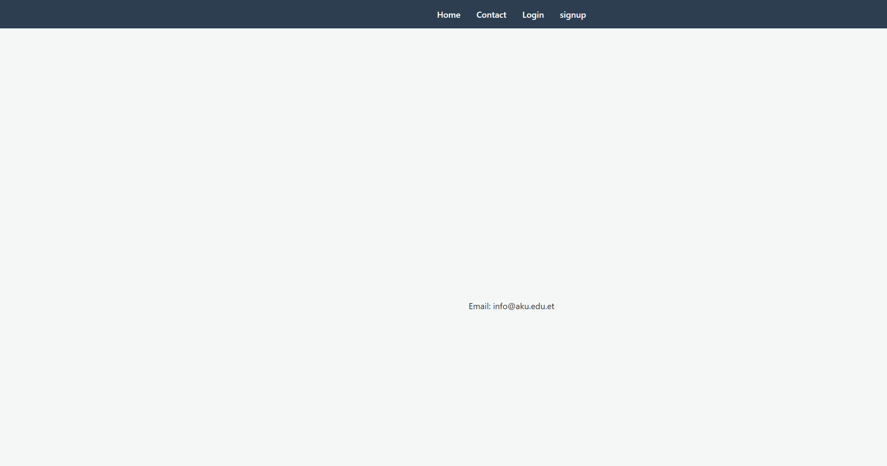

# Student Information Management System (SIMS)

A web-based **Student Information Management System**. The application supports role-based access for administrators, heads of department (HOD), teachers, and students to manage academic records, course registration, and grades.

## Features

### Admin
- View all students, teachers, and grades
- Manage system-wide academic data from the admin dashboard

### Head of Department (HOD)
- Approve grades submitted by teachers
- View department courses
- Assign courses to teachers

### Teacher
- Enter student grades (assessment, quiz, final exam)
- Submit grades to HOD for approval
- View pending grade submissions

### Student
- Register for courses by year and semester
- View approved grades
- Update profile and password

## Tech Stack

| Layer      | Technology        |
| ---------- | ----------------- |
| Frontend   | HTML, CSS         |
| Backend    | PHP               |
| Database   | MySQL             |
| Server     | Apache (XAMPP/WAMP/LAMP) |

## Project Structure

```
Student managment system/
├── Assets/
│   ├── login/                  # Login page screenshots and images
│   ├── dashboard/              # Dashboard screenshots and images
│   └── other/                  # Additional UI and project images
├── database/
│   └── schema.sql              # Database tables
└── SIMS/
    ├── index.html              # Home page
    ├── login.html / login.php  # Unified login
    ├── signup.html             # Registration hub
    ├── connection.php          # Database connection
    ├── admin_dashboard.php     # Admin portal
    ├── hoddashboard.php        # HOD portal
    ├── teacher_dashboard.php   # Teacher portal
    ├── student_dashboard.php   # Student portal
    ├── style.css / styl.css    # Stylesheets
    └── ...                     # Role-specific pages
```

## Prerequisites

- [XAMPP](https://www.apachefriends.org/) (or any PHP + MySQL + Apache stack)
- PHP 7.x or later
- MySQL

## Installation

### 1. Clone or copy the project

Place the project folder on your machine. The application lives in the `SIMS/` directory.

### 2. Start Apache and MySQL

Launch XAMPP (or your stack) and start **Apache** and **MySQL**.

### 3. Create the database

1. Open [phpMyAdmin](http://localhost/phpmyadmin)
2. Import [`database/schema.sql`](database/schema.sql) to create the `project` database and tables

The application uses these tables:

   - `admin` — administrator accounts
   - `headde` — head of department accounts
   - `teacher` — teacher accounts
   - `student` — student records
   - `courses` — course catalog
   - `grades` — grade entries and approval status
   - `student_courses` — student course enrollments
   - `teacher_course` — teacher–course assignments

### 4. Configure the database connection

Edit `SIMS/connection.php` if your MySQL credentials differ from the defaults:

```php
$conn = mysqli_connect("localhost", "root", "", "project")
  or die("Connection Error: " . mysqli_connect_error());
```

| Parameter  | Default     |
| ---------- | ----------- |
| Host       | `localhost` |
| Username   | `root`      |
| Password   | *(empty)*   |
| Database   | `project`   |

### 5. Deploy to the web server

Copy the `SIMS` folder into your web root, for example:

- **XAMPP:** `C:\xampp\htdocs\SIMS`
- **Linux:** `/var/www/html/SIMS`

### 6. Open the application

Visit:

```
http://localhost/SIMS/
```

## Usage

### Registration

From the home page, go to **Signup** and choose a role:

- **Student** — `s_register.html`
- **Teacher** — `T_register.html`
- **HOD** — `hod_register.html`

Admin accounts are created separately via `admin_signup.php`.

### Login

Use **Login** on the home page. The system checks credentials against admin, HOD, teacher, and student tables and redirects to the appropriate dashboard.

### Grade workflow

1. **Teacher** enters grades in **Entry Grade**
2. Grades are saved with a pending status
3. **Teacher** submits grades to HOD
4. **HOD** reviews and approves grades in **Approve Grades**
5. **Student** views approved grades in their dashboard

## User Roles Summary

| Role    | Dashboard               | Main actions                          |
| ------- | ----------------------- | ------------------------------------- |
| Admin   | `admin_dashboard.php`   | View students, teachers, all grades   |
| HOD     | `hoddashboard.php`      | Approve grades, manage courses        |
| Teacher | `teacher_dashboard.php` | Enter and submit grades               |
| Student | `student_dashboard.php` | Register courses, view grades, profile |

## Screenshots

UI screenshots are stored in the [`Assets/`](Assets/) folder. Click any link or image to open the full file.

| Screen | Link |
| ------ | ---- |
| Home page | [Assets/other/home.png](Assets/other/home.png) |
| Login | [Assets/login/login.png](Assets/login/login.png) |
| Signup | [Assets/other/signup.png](Assets/other/signup.png) |
| Contact | [Assets/other/contact.png](Assets/other/contact.png) |
| Student registration | [Assets/other/student_register.png](Assets/other/student_register.png) |
| Teacher registration | [Assets/other/teacher_register.png](Assets/other/teacher_register.png) |
| HOD registration | [Assets/other/hod_register.png](Assets/other/hod_register.png) |
| Admin dashboard | [Assets/dashboard/admin_dashboard.png](Assets/dashboard/admin_dashboard.png) |
| HOD dashboard | [Assets/dashboard/hod_dashboard.png](Assets/dashboard/hod_dashboard.png) |
| Teacher dashboard | [Assets/dashboard/teacher_dashboard.png](Assets/dashboard/teacher_dashboard.png) |
| Student dashboard | [Assets/dashboard/student_dashboard.png](Assets/dashboard/student_dashboard.png) |

### Home page

[](Assets/other/home.png)

### Login

[](Assets/login/login.png)

### Signup

[](Assets/other/signup.png)

### Dashboards

| Admin | HOD | Teacher | Student |
| ----- | --- | ------- | ------- |
| [](Assets/dashboard/admin_dashboard.png) | [](Assets/dashboard/hod_dashboard.png) | [](Assets/dashboard/teacher_dashboard.png) | [](Assets/dashboard/student_dashboard.png) |

### Registration pages

| Student | Teacher | HOD |
| ------- | ------- | --- |
| [](Assets/other/student_register.png) | [](Assets/other/teacher_register.png) | [](Assets/other/hod_register.png) |

### Contact

[](Assets/other/contact.png)

## Developed by

**Fsha Mekonen**

Information Technology Student

Aksum University

## Contact

- **Email:** fishmekonenn@gmail.com
- **GitHub:** https://github.com/FshaMekonen
